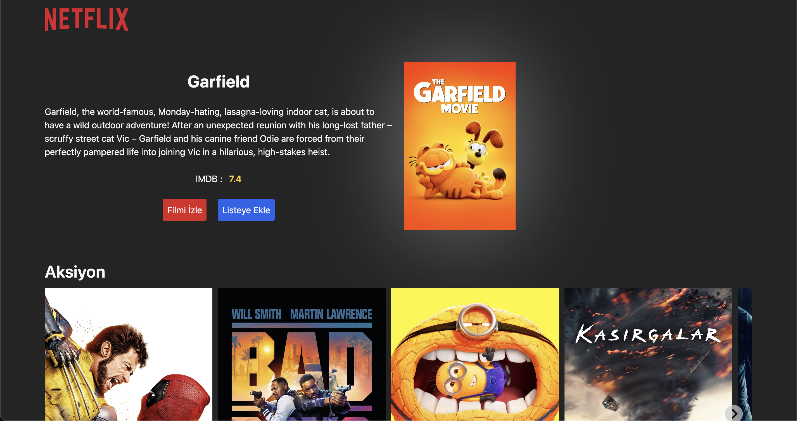
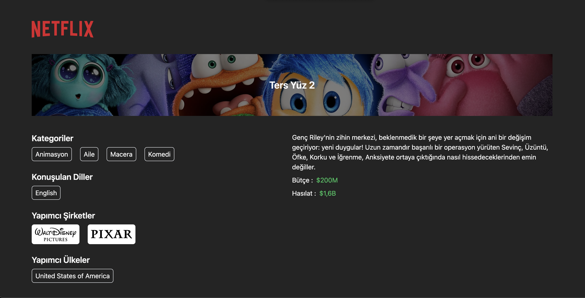
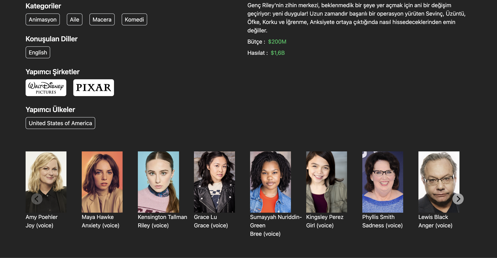

### Netflix Clone 


This project is a web application that mimics the core functionality of Netflix. Users can browse various movies and series. The project is designed to utilize the Redux-Thunk architecture for managing asynchronous state changes effectively.


<h2> Video gif</h2>


<h2>ScreenShoots</h2>

<h3> main page </h3>



<h3> Detail page </h3>






## Table of Contents


- Features
- Requirements
- Installation
- Usage
- Commands
- Technologies
- API
- Contributing
- Contact

## Features

-Browse movies and series
-Detailed movie page with information about the cast, production companies, revenue, and more

## Requirements

-Node.js (v14 or higher)
npm or yarn as a package manager
-Firebase or a similar backend service (optional)


 ##  Installation 

-Clone the project to your local machine:
git clone https://github.com/username/netflix-clone.git

-Navigate to the project directory:
```
cd netflix-clone
```
-Install the necessary packages:
```
npm install
```
# or
 ```
 yarn install
```
## Usage

-Start the development server:
```
npm run dev
```
# or
```
yarn dev
```

Visit http://localhost:3000 in your browser.

## Commands

-npm run dev or yarn dev: Starts the development server.
-npm run build or yarn build: Builds the project for production.
-npm run preview or yarn preview: Previews the production build locally.
-npm run lint or yarn lint: Lints the code and highlights potential errors.

 
## Technologies 
The main technologies and libraries used in this project are:


-React
-Vite
-Redux and Redux-Thunk
-React Redux
-React Router DOM
-Axios
-Tailwind CSS
-@splidejs/react-splide
-Millify


## API
This project uses The Movie Database (TMDb) API to fetch movie and series data. You will need to sign up for an API key on their website to access the data.

<h2>Contributing</h2>

Contributions are welcome! Please open an issue first to discuss what you would like to change.

1.Fork the project
2.Create your feature branch (git checkout -b feature/NewFeature)
3.Commit your changes (git commit -m 'Add new feature')
4.Push to the branch (git push origin feature/NewFeature)
5.Open a Pull Request


<h2>Contact</h2>


Özer BAYKAL  mail : baykalozer87@gmail.com

Project Link: https://github.com/ozerbaykal/netflix-clone

